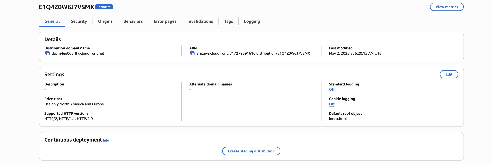
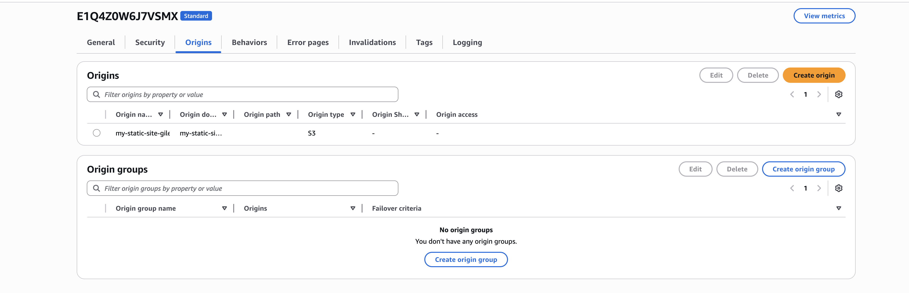
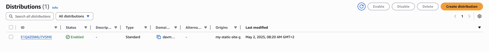

# 🌍 AWS S3 + CloudFront Static Site with CDN

This project shows how to speed up and secure a static website hosted on S3 using Amazon CloudFront CDN.

## 🔧 Tech Stack
- AWS S3 (static site)
- AWS CloudFront (CDN + HTTPS)
- HTML/CSS

## 🚀 Live Site (via CloudFront)
🔗 [Visit Site](https://davm4eq005r87.cloudfront.net/)

## 📸 Screenshots

### CloudFront Distribution

### Origin Setup

### Deployed Status

### Live Site via CDN

## 📄 Deployment Steps

See `deployment_steps.md` for full instructions.
